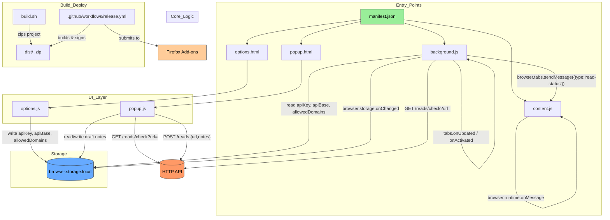

```mermaid
graph TD
    subgraph Entry_Points
        M[manifest.json] --> BG[background.js]
        M --> C[content.js]
        M --> POP[popup.html]
        M --> OPT[options.html]
    end

    subgraph UI_Layer
        POP --> POPJS[popup.js]
        OPT --> OPTJS[options.js]
    end

    subgraph Core_Logic
        BG[background.js]
        C[content.js]
    end

    subgraph Storage
        S[(browser.storage.local)]
    end

    subgraph Build_Deploy
        B[build.sh]
        GHA[.github/workflows/release.yml]
        DIST[dist/ .zip]
    end

    BG -- "tabs.onUpdated / onActivated" --> BG
    BG -- "browser.tabs.sendMessage({type:'read-status'})" --> C
    C -- "browser.runtime.onMessage" --> C
    BG -- "GET /reads/check?url=" --> API[(HTTP API)]
    POPJS -- "GET /reads/check?url=" --> API
    POPJS -- "POST /reads {url,notes}" --> API

    OPTJS -- "write apiKey, apiBase, allowedDomains" --> S
    BG -- "read apiKey, apiBase, allowedDomains" --> S
    POPJS -- "read/write draft notes" --> S
    BG -- "browser.storage.onChanged" --> S

    B -- "zips project" --> DIST
    GHA -- "builds & signs" --> DIST
    GHA -- "submits to" --> AMO[Firefox Add-ons]

    style API fill:#f96,stroke:#333,color:#000
    style S fill:#6af,stroke:#333,color:#000
    style M fill:#9e9,stroke:#333,color:#000
    style AMO fill:#fc9,stroke:#333,color:#000
```
